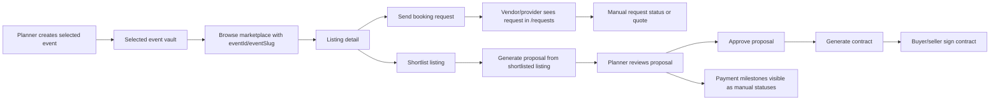

# OneHub Gate 4 Phase 4A — Event Transaction Loop Map

Status: review-required
Generated: 2026-06-02T16:51:58Z
Scope: read-only/product-flow audit plus this evidence report. No app code edits, no DB mutations, no credentials/billing/infra/production setting changes, no live payment actions, no public exposure, no Oracle.

## Gate 4 target

Gate 4 must prove the selected-event marketplace transaction loop works end to end:

Event Creation -> Vendor/Venue Discovery -> Booking Request or Shortlist -> Proposal -> Proposal Approval -> Contract/Agreement -> manual-status-first milestone/payment visibility.

Gate 3 exit evidence approved Gate 4 planning only. It did not approve production deployment, live payment movement, real legal obligations, public exposure, external analytics, or infrastructure changes.

## Controlling inputs inspected

- `/root/ONEHUB_PRODUCTION_BUILD_PLAN.md`, Gate 4 lines 559-745.
- `reports/production/gate3/GATE3_EXIT_SYNTHESIS.md`.
- `reports/production/gate3/phase3a/role-onboarding-audit.md`.
- `reports/production/gate3/phase3b/role-selection-routing/evidence.md`.
- `reports/production/gate3/phase3c/onboarding-flows/evidence.md`.

Gate 3 accepted readiness facts:

- DIY Planner, Pro Planner, Vendor, Venue are the public MVP signup roles.
- Client remains invite/event-linked for MVP.
- Admin remains manual/internal provisioning only.
- Event Dreamer is outside the Gate 3 MVP role model.
- Gate 4 should remain selected-event-first and manual-status-first for payments unless separately approved.

## Files/routes inspected for transaction-loop mapping

Data model:

- `apps/web/prisma/schema.prisma`
  - `Event` lines 294-342.
  - `ShortlistItem` lines 344-355.
  - `Listing` lines 517-553.
  - `BookingRequest` lines 597-618.
  - `Proposal` / `ProposalLineItem` / `PaymentMilestone` / `ProposalSection` lines 635-702.
  - `Contract` / `Signature` / payment-adjacent records lines 704-823.
  - Enums: `BookingStatus`, `ProposalStatus`, `MilestoneStatus`, `ContractStatus`, `PaymentIntentStatus`, `PayoutStatus` lines 1350-1429.

Core APIs/routers:

- `apps/web/src/server/router/index.ts` — registers `listing`, `availability`, `bookingRequest`, `search`, `proposal`, `contract`, `billing`, `shortlist` routers.
- `apps/web/src/server/routers/search.ts` — tRPC listing search with type/category/location/rating/tag filters, ordered by created date.
- `apps/web/src/server/routers/listing.ts` — listing create/update/get/list and media/tag operations.
- `apps/web/src/server/routers/shortlist.ts` — event-scoped shortlist list/add/remove/isShortlisted.
- `apps/web/src/server/routers/bookingRequest.ts` — create/list/status/quote booking request operations.
- `apps/web/src/server/routers/proposal.ts` — create/send/accept/reject proposals; accept creates a basic contract and escrow account.
- `apps/web/src/server/routers/contract.ts` — get/render/sendForSignature/sign/change-order operations.
- `apps/web/src/app/api/vendors/search/route.ts` — public vendor-search API for organizations/listings; has keyword/location/category/sort filters.
- `apps/web/src/app/api/bookings/request/route.ts` — selected-event booking request POST.
- `apps/web/src/app/api/proposals/generate/route.ts` — AI-generated proposal from event/listing context.
- `apps/web/src/app/api/proposals/[id]/approve/route.ts` — proposal approval with legal acceptance record.
- `apps/web/src/app/api/contracts/from-proposal/route.ts` — accepted proposal to contract creation.
- `apps/web/src/app/api/contracts/[id]/sign/route.ts` — authenticated buyer/seller contract signing.

User-facing routes/components:

- `apps/web/src/app/marketplace/page.tsx` — marketplace browse with selected-event query propagation.
- `apps/web/src/app/marketplace/[slug]/page.tsx` — listing detail with selected-event banner, shortlist action, and booking request action.
- `apps/web/src/components/bookings/BookingRequestButtonClient.tsx`.
- `apps/web/src/components/bookings/BookingRequestModal.tsx`.
- `apps/web/src/components/shortlist/AddToShortlistButtonClient.tsx`.
- `apps/web/src/app/(app)/requests/page.tsx` — booking request inbox/list view.
- `apps/web/src/app/(app)/vault/[eventSlug]/page.tsx` — legacy selected-event vault; includes booking requests, shortlist, proposal generation, proposal list, milestone/payment count visibility.
- `apps/web/src/app/diy-planner/vault/[eventSlug]/page.tsx` and `apps/web/src/app/pro/planner/vault/[eventSlug]/page.tsx` — role-specific wrappers/selected-event vault paths.
- `apps/web/src/app/(app)/events/[eventSlug]/proposals/new/page.tsx` — placeholder that redirects users back to vault for AI proposal generation.
- `apps/web/src/app/(app)/proposals/[id]/page.tsx` and `apps/web/src/components/proposals/ProposalPageClient.tsx` — proposal review/edit/approve/generate-contract surface.
- `apps/web/src/app/(app)/contracts/[id]/page.tsx` — contract detail/signing surface.

Repo state note:

- `git status --short` still shows a broad dirty shared workspace, including Gate 2/Gate 3/security/maintenance artifacts and this report tree. This report is a current-state map, not a clean-release verdict.

## Current transaction state map

Important distinction: the code has both a booking-request/quote path and a proposal/contract path, but they are only loosely connected. A booking request does not currently force or own proposal creation. A shortlisted listing can generate a proposal directly, and a proposal can be generated without a booking request.

## Current data states

### Event

`Event.status`:

- `PLANNING`
- `ACTIVE`
- `ON_HOLD`
- `COMPLETED`
- `CANCELED`

Gate 4 MVP path starts from a selected `PLANNING` event.

### Booking request

`BookingStatus`:

- `PENDING`
- `HOLD`
- `QUOTED`
- `DECLINED`
- `EXPIRED`
- `WITHDRAWN`

Current use:

- `/api/bookings/request` creates `PENDING` booking requests tied to `eventId` and `listingId`.
- `bookingRequest.quote` sets request to `QUOTED` and stores `quoteCents`/notes.
- `bookingRequest.setStatus` supports the full enum.
- `/requests` displays requests, event link, listing, contact info, status, message, and quote amount.

Gap: no user-facing vendor/provider action controls were found on `/requests`; it appears to be a read/list view. tRPC status/quote mutations exist, but the inspected page does not expose a response workflow.

### Proposal

`ProposalStatus`:

- `DRAFT`
- `SENT`
- `ACCEPTED`
- `REJECTED`
- `EXPIRED`
- `CONVERTED`

Current use:

- `proposal.create` creates `DRAFT` proposals with line items and payment milestones.
- `/api/proposals/generate` creates `DRAFT` AI proposals from selected event and optional listing context.
- `proposal.send` can set `SENT`, but the proposal page permits approval for both `DRAFT` and `SENT`.
- `/api/proposals/[id]/approve` sets `ACCEPTED` and records acceptance.
- `/api/contracts/from-proposal` accepts `ACCEPTED` or `CONVERTED` and then creates a contract and sets proposal to `CONVERTED`.

Gap: proposal creation is currently planner/vault-driven. The Gate 4 target says vendor/provider responds with proposal/quote; a true vendor-authored proposal response to a booking request is not yet a coherent user-facing flow.

### Contract/agreement

`ContractStatus`:

- `DRAFT`
- `OUT_FOR_SIGNATURE`
- `PARTIALLY_SIGNED`
- `FULLY_SIGNED`
- `CANCELED`
- `ACCEPTED`
- `IN_PAYMENT`
- `ACTIVE`
- `COMPLETED`

Current use:

- `proposal.accept` in tRPC creates a basic `OUT_FOR_SIGNATURE` contract and escrow account, but the UI/API path inspected uses `/api/proposals/[id]/approve` followed by `/api/contracts/from-proposal`.
- `/api/contracts/from-proposal` creates a `DRAFT` contract from an accepted/converted proposal and sets buyer/seller org IDs.
- `/api/contracts/[id]/sign` creates/updates signatures and moves contract to `PARTIALLY_SIGNED` or `FULLY_SIGNED` based on buyer-side and seller-side signatures.
- `contract.sendForSignature` can create signer rows and set `OUT_FOR_SIGNATURE`, but email sending is stubbed.

Gap: there are duplicate contract-creation paths (`proposal.accept` tRPC and `/api/contracts/from-proposal`) with different side effects/statuses. Phase 4B should pick one MVP path and avoid expanding legal/payment automation.

### Milestones/payments

`MilestoneStatus`:

- `PENDING`
- `HELD`
- `PARTIALLY_PAID`
- `PAID`
- `REFUNDED`
- `IN_ESCROW`
- `OVERDUE`

`PaymentIntentStatus`:

- `REQUIRES_PAYMENT`
- `PROCESSING`
- `SUCCEEDED`
- `FAILED`
- `CANCELLED`

`PayoutStatus`:

- `PENDING`
- `SENT`
- `FAILED`
- `CANCELED`

Current use:

- Proposal milestones are created by proposal generation and displayed on proposal detail.
- Selected-event vault counts proposal milestones with `PENDING` as payments due and `PAID` as payments received.
- Payment APIs and Stripe-adjacent models exist, but Gate 4 current scope should preserve manual-status-first visibility.

Gap: no Gate 4 approval exists to exercise live payment flows, Stripe actions, payouts, refunds, holdbacks, or escrow automation.

## What currently works

1. Selected-event context exists.
   - Marketplace links can carry `eventId`, `eventSlug`, `eventName`, and `returnTo` from the event vault.
   - Listing detail reflects selected-event context and enables shortlist/booking actions only when an `eventId` is present.

2. Marketplace/listing discovery exists.
   - `/marketplace` lists `Listing` records.
   - `search.searchListings` supports type/category/city/state/country/rating/tag and query search.
   - `/api/vendors/search` supports vendor org/listing keyword, location, category, and sort filters.

3. Shortlist exists as an event-scoped trust spine.
   - `ShortlistItem` links `eventId` to `listingId` with uniqueness.
   - The selected-event vault surfaces shortlisted listings and provides direct `Request booking` and `GenerateProposalButton` actions.

4. Booking request creation exists.
   - `/api/bookings/request` validates authenticated user, selected event access, listing existence, dates, and guests, then creates `BookingRequest` status `PENDING`.
   - Booking requests are visible on `/requests` and in selected-event vault vendor updates.

5. Proposal generation/review exists.
   - `/api/proposals/generate` can create a `DRAFT` proposal from event/listing context with line items, sections, and payment milestones.
   - Proposal detail shows event/listing, terms/content, pricing, payment schedule, approval UI, and contract generation if accepted.

6. Contract creation/signing exists.
   - `/api/contracts/from-proposal` can convert an accepted/converted proposal with listing context into a `DRAFT` contract.
   - `/api/contracts/[id]/sign` records electronic/demo signatures and derives `PARTIALLY_SIGNED`/`FULLY_SIGNED` based on buyer/seller side.

7. Manual milestone/payment-status visibility exists.
   - Proposal milestones are visible.
   - Selected-event vault shows simple payment due/received counts from milestone statuses without requiring live money movement.

## Missing or weak continuity

1. Vendor/provider response is not coherent yet.
   - `/requests` lists booking requests but does not expose inspected UI controls for vendor/provider quote/decline/hold/counter/proposal creation.
   - tRPC has `bookingRequest.quote` and `setStatus`, but the user-visible response path is weak.
   - User-visible impact: the requester can send a booking request, but the vendor/provider side may dead-end at a read-only request list.

2. Booking request and proposal are not structurally linked.
   - `Proposal` has `eventId` and optional `listingId`, but no `bookingRequestId`.
   - A proposal can be generated from shortlist/listing without a request, so the flow can skip the requested booking context.
   - User-visible impact: planner/client may not know whether a proposal is a response to the request they sent or a separate AI-generated draft.

3. Proposal authorship is inverted for the Gate 4 narrative.
   - The current strongest UI path is planner generates vendor-specific AI proposal from shortlist.
   - Gate 4 MVP narrative asks vendor/provider responds with proposal/quote.
   - User-visible impact: the marketplace transaction loop feels planner-drafted rather than provider-responded unless Phase 4B narrows the acceptable MVP to "quote/status first, planner-generated proposal second" or implements provider response controls.

4. Discovery has duplicate search surfaces.
   - `/marketplace` currently lists latest listings without obvious filter UI in the inspected page.
   - `search.searchListings` and `/api/vendors/search` both provide filtering logic but are different surfaces/data shapes.
   - User-visible impact: the route can browse providers, but Gate 4 search verification should target the actual selected-event route users touch, not only API filters.

5. Contract creation paths are duplicated.
   - tRPC `proposal.accept` creates a basic contract and escrow immediately.
   - REST `/api/proposals/[id]/approve` only accepts proposal, then `/api/contracts/from-proposal` generates a richer contract.
   - User-visible impact: implementation risk if different UI/API paths produce different statuses or escrow side effects.

6. Notifications/email remain partial/stubbed.
   - Booking request route logs in demo mode and has TODO for email notification.
   - Contract signing route has TODO for email notification.
   - tRPC request creation uses in-app notification to listing org admins/owners, but the REST request route inspected does not mirror that notification behavior.
   - User-visible impact: a request may persist, but the provider may not reliably know to respond without visiting `/requests`.

7. Manual-status-first payments must remain constrained.
   - Payment and escrow primitives exist, but current Gate 4 should not activate live payment flows without explicit approval.
   - User-visible impact: milestone/payment state can be visible, but should be clearly non-live/manual until Gate 5/payment authorization.

## Blockers and inherited risks

- Gate 3 stale/duplicate card risk remains from Gate 3 exit synthesis: older blocked/todo cards were superseded by Sentinel PASSes, but board state is noisy.
- Shared workspace is broadly dirty; this Phase 4A map should not be treated as release-clean evidence.
- No browser/Playwright smoke evidence was captured in this task; this is code and artifact inspection only.
- Any live payments, real contracts, production migrations, public exposure, credentials, billing, infra, or external-provider work remains blocked pending explicit Marlon approval.

## Concrete happy-path test scenario for Phase 4B/verification

Scenario name: `selected-event-catering-transaction-loop`

Preconditions:

- Authenticated Pro Planner or DIY Planner can access a selected event named `Summer Wedding`.
- At least one internal vendor listing exists for category `CATERING`, city `Los Angeles`, with a vendor/venue org owner/admin able to access `/requests`.
- Demo/local mode only. No live payment action and no production DB mutation.

Steps and expected outcomes:

1. Planner opens role-specific event vault.
   - Route: `/pro/planner/vault/{eventSlug}` or `/diy-planner/vault/{eventSlug}`.
   - Expected: event loads; Proposals card shows selected-event marketplace entrypoint.

2. Planner browses marketplace for selected event.
   - Route: `/marketplace?eventId={eventId}&eventSlug={eventSlug}&eventName=Summer%20Wedding&returnTo=...`.
   - Expected: listings render; selected-event banner appears; listing links preserve selected-event query.

3. Planner opens a catering listing.
   - Route: `/marketplace/{listingSlug}?eventId={eventId}&eventSlug={eventSlug}&eventName=Summer%20Wedding&returnTo=...`.
   - Expected: selected-event banner appears; `Add to shortlist` and `Request booking for this event` actions are available.

4. Planner shortlists the listing.
   - API/router: `shortlist.add` or `/api/shortlist` path used by component.
   - Expected: `ShortlistItem(eventId, listingId)` exists; event vault shows the shortlisted listing.

5. Planner sends booking request.
   - API: `POST /api/bookings/request`.
   - Expected: `BookingRequest` exists with `status=PENDING`, event/listing/contact/date/message fields; event vault vendor updates and `/requests` list the request.

6. Vendor/provider responds.
   - Current-state expected: weak/partial. `/requests` displays the request, but visible response controls were not found.
   - Phase 4B expected: provider can set `QUOTED`/`DECLINED`/`HOLD` and optionally create a proposal tied to event/listing/request context.

7. Planner reviews proposal.
   - Current route: event vault `GenerateProposalButton` for shortlisted listing -> `/api/proposals/generate`, then `/proposals/{id}`.
   - Expected: proposal displays event/listing context, line items, terms, payment schedule with manual milestone statuses.

8. Planner approves proposal.
   - API: `POST /api/proposals/{id}/approve`.
   - Expected: proposal status becomes `ACCEPTED`; legal acceptance is recorded; no live payment is triggered.

9. Planner generates agreement/contract.
   - API: `POST /api/contracts/from-proposal`.
   - Expected: contract exists, proposal status becomes `CONVERTED`, contract detail route can be opened.

10. Buyer and seller sign.
    - API: `POST /api/contracts/{id}/sign` for buyer and seller authenticated users.
    - Expected: first signature moves `PARTIALLY_SIGNED`, second moves `FULLY_SIGNED`; no live payment is triggered.

## Route/API/evidence matrix

| Loop step | User route/surface | API/router/model | Current state | Evidence to capture in Phase 4B |
|---|---|---|---|---|
| Event creation/selection | `/events/new`, role-specific vault routes | `POST /api/events/create`, `Event` | Works enough for Gate 4 planning per Gate 3 exit; selected event vault exists | Event id/slug, role-specific route screenshot/log |
| Discovery | `/marketplace`, `/marketplace/{slug}` | `search.searchListings`, `/api/vendors/search`, `Listing` | Browse works; filtering surfaces are split | Search/filter result log for category/city; selected-event query preservation |
| Shortlist | Listing detail, event vault shortlist block | `shortlist.add/list/remove`, `ShortlistItem` | Works as selected-event spine | Shortlist record appears in event vault |
| Booking request | Listing detail modal | `POST /api/bookings/request`, `bookingRequest.create`, `BookingRequest` | Request creation works | Request row with `PENDING` and event/listing linkage |
| Provider response | `/requests` | `bookingRequest.quote`, `bookingRequest.setStatus` | Partial: data/mutations exist; user-facing response controls not confirmed | Provider action sets `QUOTED`/`DECLINED` and records activity/notification |
| Proposal | Event vault, `/proposals/{id}` | `/api/proposals/generate`, `proposal.create/send/accept`, `Proposal` | Works but planner-generated; not tied to request | Proposal has event/listing/request context and correct status |
| Approval | `/proposals/{id}` | `POST /api/proposals/{id}/approve`, acceptance record | Works for proposal acceptance | Status `ACCEPTED`, acceptance version recorded |
| Contract/agreement | `/proposals/{id}`, `/contracts/{id}` | `POST /api/contracts/from-proposal`, `Contract`, `Signature` | Works with duplicate path risk | Contract generated from accepted proposal, no duplicate side effects |
| Signature | `/contracts/{id}` | `POST /api/contracts/{id}/sign` | Works for buyer/seller signature status | `PARTIALLY_SIGNED` then `FULLY_SIGNED` |
| Milestone/payment visibility | Proposal detail, event vault payments card | `PaymentMilestone`, statuses | Manual-status visibility exists | Milestone schedule visible; no live payment action |

## Phase 4A coherence verdict

Verdict: PARTIAL.

The selected-event commerce spine is present and stronger than a generic directory flow: event vault -> marketplace with event context -> listing -> shortlist/request -> proposal -> approval -> contract -> signatures -> milestone visibility. However, the exact Gate 4 MVP narrative is not fully coherent yet because provider response is weak, booking requests are not linked to proposals, proposal authorship is planner-driven, notifications are partial, and contract creation has duplicate paths.

## Recommended Phase 4B implementation card body

Title: `Gate 4B: connect selected-event booking request to provider response and proposal/contract spine`

Assignee recommendation: Forge for implementation, then Sentinel for verification. Steward should review contract/payment boundary language if Phase 4B touches agreement copy or acceptance semantics.

Body:

OneHub Gate 4 Phase 4B Integration — narrow implementation for selected-event transaction loop.

Scope:
- Work only in the OneHub repo/workspace.
- No production deployment, no live/staging DB mutation, no credential/billing/infra/production setting change, no public exposure, no live payment/Stripe/payout/refund/holdback action, no Oracle.
- Preserve manual-status-first milestone/payment visibility. Do not implement live money movement.
- Preserve Gate 3 MVP roles: public DIY Planner, Pro Planner, Vendor, Venue; Client invite/event-linked; Admin internal/manual.

Use Phase 4A report as controlling evidence:
- `reports/production/gate4/phase4a/transaction-loop-map.md`

Required implementation:
1. Pick one MVP route path and make it coherent:
   - selected event vault -> marketplace selected-event route -> listing detail -> shortlist and/or booking request -> provider request inbox/response -> proposal detail -> approve proposal -> contract from proposal -> contract signing.
2. Add/repair user-visible provider response controls for booking requests on the existing safe surface, preferably `/requests`:
   - provider/org owner/admin can set `HOLD`, `QUOTED`, or `DECLINED` for requests belonging to their listing org.
   - if quoting, capture quote amount and optional note using existing `BookingRequest.quote`/status semantics or equivalent safe API.
   - requester can see updated request status from selected-event vault and `/requests`.
3. Connect proposal generation to selected-event commerce context without adding live payments:
   - proposal generated from a shortlisted/requested listing must clearly show event and listing context.
   - if adding a direct `bookingRequestId` relation is necessary, include a migration plan but do not run production migrations; otherwise record/link request context through safe metadata/copy only.
   - avoid duplicate proposal/contract creation routes where possible; document which path is canonical for MVP.
4. Preserve contract/agreement safety:
   - proposal approval records acceptance as already implemented.
   - contract generation remains from accepted proposal only.
   - signing remains authenticated buyer/seller side and demo/local-safe.
5. Preserve manual milestone/payment status only:
   - display proposal milestone/payment schedule.
   - do not call Stripe, create live payment intents, release payouts, process refunds, or activate escrow automation.
6. Add targeted evidence/tests:
   - at minimum, unit/component/API tests for provider request response permissions/status update and proposal/contract happy path if existing test harness supports it.
   - produce a Gate 4B evidence report naming changed files, routes tested, commands run, and exact pass/fail results.

Acceptance criteria:
- Planner can start from selected event, browse marketplace with event context, open listing, shortlist or request booking.
- Provider can see and respond to that request with status/quote from a user-visible route.
- Planner can see response status and generate/review/approve proposal with event/listing context.
- Accepted proposal can generate a contract, and buyer/seller signatures move contract toward `FULLY_SIGNED`.
- Milestone/payment schedule remains visible but non-live/manual-status-first.
- No live payment, production, infrastructure, credential, public exposure, or Oracle action occurs.

Review-required handoff must include:
- changed files,
- tests/commands run,
- exact route/API evidence,
- whether a migration was proposed or avoided,
- confirmation that live payment/infrastructure/production actions were not performed.
