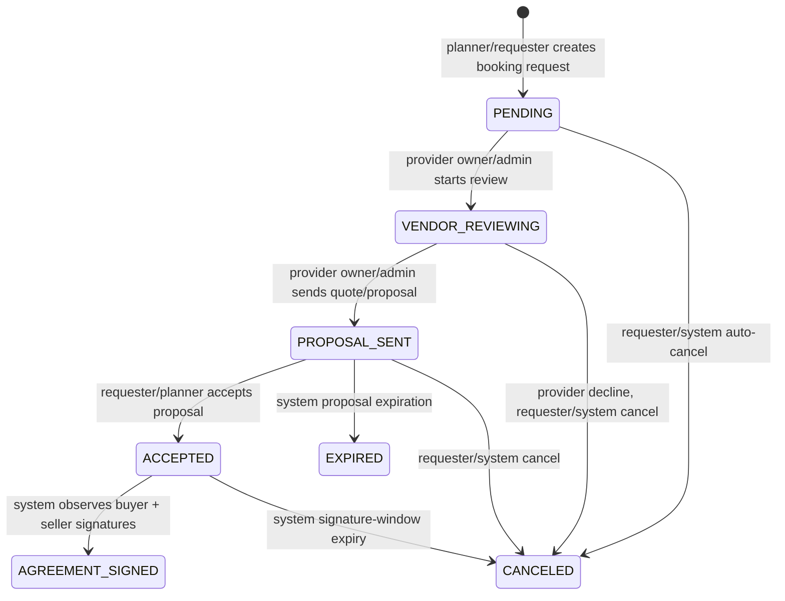

# Gate 4 Phase 4C — Transaction State Machine Notes

Scope: selected-event booking request -> provider proposal -> requester approval -> agreement signature loop. This is local repo/test evidence only; no production exposure, credential changes, billing changes, infrastructure changes, live payment actions, public exposure, or Oracle work.

## Canonical state path

## Implemented rules

Implementation anchor: `apps/web/src/lib/transaction-loop.ts`.

- Provider-side actions map legacy `BookingStatus` values into transaction states without running a schema migration.
  - `PENDING` -> `PENDING`
  - `HOLD` -> `VENDOR_REVIEWING`
  - `QUOTED` -> `PROPOSAL_SENT`
  - `DECLINED` / `WITHDRAWN` -> `CANCELED`
  - `EXPIRED` -> `EXPIRED`
- Provider `QUOTED` from `PENDING` emits two audited transition steps:
  - `PENDING -> VENDOR_REVIEWING`
  - `VENDOR_REVIEWING -> PROPOSAL_SENT`
- Requester acceptance emits `PROPOSAL_SENT -> ACCEPTED` when an accepted proposal summary carries the booking request id from the Gate 4B manual-status-first proposal response.
- System agreement completion emits `ACCEPTED -> AGREEMENT_SIGNED` only when buyer-side and seller-side signatures both exist.

## Actor gates

- Provider transitions require provider/listing organization owner or admin authorization through existing `/api/bookings/respond` permission logic.
- Requester acceptance requires existing event-management authorization in `/api/proposals/[id]/approve`.
- Agreement-signed transition is system-generated from `/api/contracts/[id]/sign` only after both sides have signed.

## Business timing boxes

Implementation anchor: `enforceBookingBusinessRules(...)` in `apps/web/src/lib/transaction-loop.ts`.

- Proposals expire after 7 days in `PROPOSAL_SENT`.
- Booking requests auto-cancel after 48 hours without response while still `PENDING`.
- Accepted agreements cancel after 14 days if both signatures are not complete.

These are implemented as pure business-rule evaluation helpers and tested locally. They intentionally do not create payment intents, payouts, refunds, holdbacks, escrow, or live payment side effects.

## Audit trail

Implementation anchors:

- `buildTransactionAuditEntry(...)` creates durable activity metadata with timestamp, actor role, actor id where available, from-state, to-state, and reason.
- `/api/bookings/respond` records provider transition audit entries for every planned provider response step.
- `/api/proposals/[id]/approve` records requester acceptance transition audit entries for proposals linked to a booking request by summary context.
- `/api/contracts/[id]/sign` records the system agreement-signed transition when buyer and seller signatures are complete.

Audit action: `BOOKING_REQUEST_STATE_TRANSITION`.

## Residual risk

No Prisma schema migration was run in this lane. Booking-request-to-proposal continuity still uses Gate 4B's safe manual-status-first summary linkage rather than a structural `Proposal.bookingRequestId` relation. This preserves the no-production-migration constraint but remains a Gate 4C/Steward hardening point before launch-grade release confidence.
