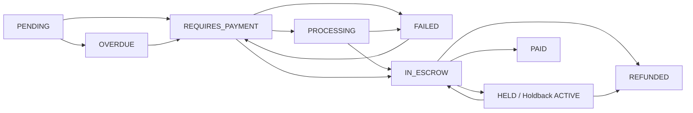

# OneHub Gate 5 Phase 5A — Milestone Payment Schedule Examples

Status: READ-ONLY PLANNING EVIDENCE
Generated: 2026-06-02T17:58:16Z
Scope: documentation/modeling only. These are example schedules for pilot design discussion. They are not legal terms, not billing terms, not production pricing, and not approval to charge, capture, hold, release, refund, or transfer funds.

## Current model anchor

`PaymentMilestone` currently supports:
- `proposalId`
- `title`
- `description?`
- `dueType`: `DATE_ABSOLUTE` or `OFFSET_FROM_EVENT_START`
- `dueDate?`
- `dueOffsetDays?`
- `amountCents`
- `status`: `PENDING`, `HELD`, `PARTIALLY_PAID`, `PAID`, `REFUNDED`, `IN_ESCROW`, `OVERDUE`

`/api/payments/create-intent` currently treats milestones as payable only when milestone status is `PENDING` or `OVERDUE`, and when the contract is `FULLY_SIGNED` or `IN_PAYMENT`.

## Schedule design principles for Gate 5B

1. Contract first.
   - No payment schedule is payable until proposal acceptance, contract creation, and required signatures are complete.

2. Milestone amount comes from server-side proposal/contract state.
   - User-submitted amount should not override accepted proposal totals.

3. Payment status and work-delivery status must stay separate.
   - A milestone can be funded/in escrow before service completion.
   - `PAID` should mean released to provider/venue/planner, not merely payer paid.

4. Release requires no active blockers.
   - Refund requests, disputes, and holdbacks block release.

5. Pilot should start manual-status-first.
   - Stripe/test-mode implementation requires separate Marlon approval.

## Example 1 — Wedding vendor package, three-phase milestone schedule

Use case: selected-event wedding service package such as photography, catering, DJ, florist, or decor.

Assumed contract total: $6,000.00 (`600000` cents)

| Phase | Milestone title | Due type | Example due timing | Amount | Intended state path |
|---|---|---:|---|---:|---|
| 1 | Booking retainer | `DATE_ABSOLUTE` or `OFFSET_FROM_EVENT_START` | due on contract signing / 180 days before event | $1,800.00 / 30% | `PENDING` -> `REQUIRES_PAYMENT` -> `SUCCEEDED` -> `IN_ESCROW` -> release per policy |
| 2 | Planning checkpoint | `OFFSET_FROM_EVENT_START` | 60 days before event | $2,400.00 / 40% | `PENDING` -> `IN_ESCROW`; release only after checkpoint/admin acceptance |
| 3 | Final event balance | `OFFSET_FROM_EVENT_START` | 7 days before event or after event completion | $1,800.00 / 30% | `PENDING`/`OVERDUE` -> `IN_ESCROW` -> `PAID` after service/completion clearance |

Gate 5B notes:
- Good pilot default because it tests multi-milestone funding and release without needing partial-payment ambiguity.
- Requires explicit rule for whether retainer is released immediately, held until event completion, or released after admin confirmation.
- Requires cancellation/refund policy before real money.

## Example 2 — Venue booking, deposit plus final balance

Use case: venue reservation for selected event.

Assumed contract total: $12,000.00 (`1200000` cents)

| Phase | Milestone title | Due type | Example due timing | Amount | Intended state path |
|---|---|---:|---|---:|---|
| 1 | Venue reservation deposit | `DATE_ABSOLUTE` | due at contract signing | $3,000.00 / 25% | `PENDING` -> `IN_ESCROW`; release governed by venue/deposit terms |
| 2 | Final venue balance | `OFFSET_FROM_EVENT_START` | 30 days before event | $9,000.00 / 75% | `PENDING`/`OVERDUE` -> `IN_ESCROW` -> `PAID` after admin release policy |

Gate 5B notes:
- Must decide whether existing `Deposit` model is a separate event/client deposit lane or whether venue deposit is just first `PaymentMilestone`.
- Do not maintain two independent deposit concepts for the same money without reconciliation.
- Venue cancellation/refund terms are high-risk and require legal/product approval before live use.

## Example 3 — Pro planner service retainer and completion payment

Use case: client engages a professional planner for event planning services.

Assumed contract total: $8,000.00 (`800000` cents)

| Phase | Milestone title | Due type | Example due timing | Amount | Intended state path |
|---|---|---:|---|---:|---|
| 1 | Planning retainer | `DATE_ABSOLUTE` | due at signed contract | $2,000.00 / 25% | `PENDING` -> `IN_ESCROW`; possible immediate release after admin acceptance if policy permits |
| 2 | Design/vendor shortlist delivery | `OFFSET_FROM_EVENT_START` | 120 days before event | $2,000.00 / 25% | `PENDING` -> `IN_ESCROW` -> release after deliverable accepted |
| 3 | Production plan complete | `OFFSET_FROM_EVENT_START` | 30 days before event | $2,000.00 / 25% | `PENDING` -> `IN_ESCROW` -> release after deliverable accepted |
| 4 | Event execution complete | `OFFSET_FROM_EVENT_START` | 1 day after event | $2,000.00 / 25% | `PENDING` -> `IN_ESCROW` -> release after completion/no dispute window |

Gate 5B notes:
- Good for testing service-delivery milestones and admin release evidence.
- Requires deliverable/acceptance capture before release.
- Refund/dispute workflow must be ready before pilot live payments.

## Example 4 — Small vendor simple schedule

Use case: low-risk/low-dollar service such as small rental, small entertainment booking, or add-on vendor.

Assumed contract total: $1,200.00 (`120000` cents)

| Phase | Milestone title | Due type | Example due timing | Amount | Intended state path |
|---|---|---:|---|---:|---|
| 1 | Full booking payment | `DATE_ABSOLUTE` | due at contract signing | $1,200.00 / 100% | `PENDING` -> `IN_ESCROW` -> `PAID` after completion/release |

Gate 5B notes:
- Best first test-mode pilot because it avoids multi-milestone reconciliation.
- Still requires idempotency, webhook/confirm unification, and release blockers before any payment execution.

## Recommended first pilot schedule for Gate 5B test-mode

Recommended: Example 4 first, then Example 1.

Reason:
- Example 4 validates one contract, one milestone, one payment intent, one escrow balance increment, one holdback evaluation, and one release path.
- Example 1 validates multi-milestone behavior after the one-milestone reducer is proven.

## Required state transitions per milestone

Each milestone should follow this allowed path:

Forbidden or risky transitions:
- `PENDING` -> `PAID` without funding/release evidence.
- `IN_ESCROW` -> `PENDING` without explicit reversal/refund evidence.
- `FAILED` -> `IN_ESCROW` without Stripe success evidence or manual test-mode admin evidence.
- `PAID` -> `REFUNDED` without refund/reversal record and payout reconciliation.
- `HELD`/active holdback -> `PAID` without admin release/override evidence.

## Steward verdict

Verdict: SOUND for planning; BLOCKED for implementation/live use.

The schedules are feasible for OneHub's current proposal/milestone model, but Gate 5B must first approve a canonical payment reducer, test-mode-only Stripe plan, release-blocker semantics, and legal/product policy for deposits, cancellations, refunds, and disputes.
