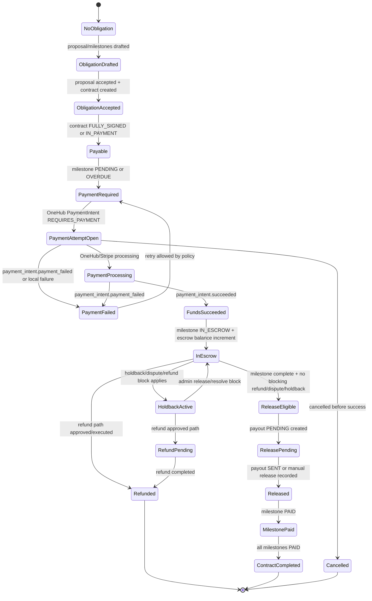

# OneHub Gate 5 Phase 5A — Money-State Diagram

Status: READ-ONLY PLANNING EVIDENCE
Generated: 2026-06-02T17:58:16Z
Scope: documentation/modeling only. No app source edits, no DB mutations, no credential changes, no billing changes, no infrastructure changes, no Stripe/webhook setup or activation, no live payment actions, no public exposure, no Oracle.

## Controlling boundary

Gate 4 exit approved Gate 5A only as a read-only setup lane. Payment behavior remains manual-status-first or future test-mode-only until Marlon gives separate explicit approval.

This diagram defines the target money-state vocabulary for Gate 5B planning. It is not an implementation approval.

## Current model anchors inspected

- `PaymentMilestone` — `apps/web/prisma/schema.prisma:678-690`
- `Contract` — `apps/web/prisma/schema.prisma:704-725`
- `EscrowAccount` — `apps/web/prisma/schema.prisma:754-766`
- `Payout` — `apps/web/prisma/schema.prisma:768-780`
- `MoneyTx` — `apps/web/prisma/schema.prisma:782-792`
- `WebhookEvent` — `apps/web/prisma/schema.prisma:794-801`
- `PaymentIntent` — `apps/web/prisma/schema.prisma:803-823`
- `Transaction` — `apps/web/prisma/schema.prisma:825-839`
- `PaymentHoldback` — `apps/web/prisma/schema.prisma:842-877`
- `Deposit` — `apps/web/prisma/schema.prisma:879-900`
- Payment/money enums — `apps/web/prisma/schema.prisma:1379-1486`
- Stripe webhook route — `apps/web/src/app/api/stripe/webhook/route.ts`
- Payment intent route — `apps/web/src/app/api/payments/create-intent/route.ts`
- Payment confirm route — `apps/web/src/app/api/payments/confirm/route.ts`
- Milestone release route — `apps/web/src/app/api/payments/release-milestone/route.ts`

## Authoritative money-state layers

OneHub should treat money state as layered, not as one overloaded status field:

1. Commercial obligation layer
   - Source: accepted proposal, contract, and payment milestones.
   - Question: what does the buyer owe, by when, and under which signed/legal surface?

2. Payment attempt layer
   - Source: OneHub `PaymentIntent` plus Stripe PaymentIntent id.
   - Question: has the payer started, failed, cancelled, or completed a payment attempt?

3. Funds-held layer
   - Source: `EscrowAccount`, `PaymentMilestone.status`, `PaymentHoldback`, disputes/refunds.
   - Question: are funds recognized as held for the proposal/milestone, and are they releasable?

4. Release/payout layer
   - Source: `Payout`, `MoneyTx`, Stripe transfer id.
   - Question: has OneHub released funds to the provider/venue/planner recipient?

5. Exception layer
   - Source: `RefundRequest`, `Dispute`, `PaymentHoldback`, admin override/acceptance audit.
   - Question: is normal release blocked, reversed, or under review?

## Target money-state diagram

## Current enum vocabulary and recommended Gate 5A interpretation

### ContractStatus

Current enum: `DRAFT`, `OUT_FOR_SIGNATURE`, `PARTIALLY_SIGNED`, `FULLY_SIGNED`, `CANCELED`, `ACCEPTED`, `IN_PAYMENT`, `ACTIVE`, `COMPLETED`.

Gate 5A interpretation:
- `FULLY_SIGNED` and `IN_PAYMENT` are the only payable contract states currently recognized by `/api/payments/create-intent`.
- `COMPLETED` should mean all payment milestones are paid/released, not just contract signing complete.
- `ACCEPTED` overlaps proposal acceptance terminology and should not be treated as payment-ready without contract/signature evidence.

### MilestoneStatus

Current enum: `PENDING`, `HELD`, `PARTIALLY_PAID`, `PAID`, `REFUNDED`, `IN_ESCROW`, `OVERDUE`.

Gate 5A interpretation:
- `PENDING` / `OVERDUE`: payable but not yet successfully funded.
- `IN_ESCROW`: payment succeeded and funds are held against the milestone.
- `HELD`: reserved for explicit exception hold, but current code primarily uses `PaymentHoldback.state`; Gate 5B should clarify or deprecate duplicate meaning.
- `PAID`: released to provider/venue/planner recipient.
- `REFUNDED`: funds returned/reversed.
- `PARTIALLY_PAID`: currently ambiguous unless partial payment support is explicitly implemented.

### PaymentIntentStatus

Current enum: `REQUIRES_PAYMENT`, `PROCESSING`, `SUCCEEDED`, `FAILED`, `CANCELLED`.

Gate 5A interpretation:
- `REQUIRES_PAYMENT`: local payment intent exists and Stripe client secret may exist.
- `PROCESSING`: Stripe status not succeeded yet, or local confirmation observed non-success.
- `SUCCEEDED`: authoritative only after server-side Stripe retrieval or webhook signature-verified success.
- `FAILED`: terminal attempt failure, retry may create a new intent.
- `CANCELLED`: old local/Stripe intent intentionally abandoned before success.

### EscrowStatus

Current enum: `OPEN`, `FUNDED`, `PARTIALLY_RELEASED`, `RELEASED`, `REFUNDED`, `CLOSED`.

Gate 5A interpretation:
- `OPEN`: proposal/contract has escrow account but no confirmed funds.
- `FUNDED`: at least one successful payment moved recognized balance into escrow.
- `PARTIALLY_RELEASED`: some, not all, escrow balance released.
- `RELEASED`: all releasable escrow balance released.
- `REFUNDED`: funds returned instead of released.
- `CLOSED`: administrative final state after reconciliation.

### PayoutStatus

Current enum: `PENDING`, `SENT`, `FAILED`, `CANCELED`.

Gate 5A interpretation:
- `PENDING`: release record created but no confirmed transfer/manual completion.
- `SENT`: Stripe transfer or equivalent approved release completed.
- `FAILED`: transfer failed; milestone should not be advanced to `PAID` without reconciliation.
- `CANCELED`: release attempt voided before completion.

### DepositStatus

Current enum: `PENDING`, `SUCCEEDED`, `FAILED`, `REFUNDED`.

Gate 5A interpretation:
- Deposit is event-scoped and separate from contract milestone escrow.
- Gate 5B must decide whether deposit remains a separate event-retainer lane or becomes a first milestone/payment-intent lane. Do not merge silently.

## Current correctness risks in the money-state shape

1. Duplicate payment success paths exist.
   - `apps/web/src/app/api/stripe/webhook/route.ts` marks payment success and increments escrow.
   - `apps/web/src/app/api/payments/confirm/route.ts` also marks success, increments escrow, creates `Transaction`, and evaluates holdback.
   - Gate 5B must define one authoritative success reducer or strict idempotency across both.

2. Escrow status update in confirm path appears semantically risky.
   - `confirm/route.ts` sets escrow status to `FUNDED` only when prior balance is zero, otherwise `PARTIALLY_RELEASED`; a second funding should likely remain `FUNDED`, not `PARTIALLY_RELEASED`.

3. Webhook success path does not create `Transaction` or evaluate holdback.
   - It updates `PaymentIntent`, `EscrowAccount`, milestone, and contract, but does not mirror confirm route's transaction/holdback/audit work.

4. Release path can perform Stripe transfer if `stripe` and recipient account exist.
   - This is not approved for Gate 5A. Gate 5B must remain test-mode-only unless Marlon separately approves live payment movement.

5. `HELD` milestone status and `PaymentHoldback.state` overlap.
   - Gate 5B must choose a canonical exception source to avoid release checks missing one layer.

## Steward verdict

Verdict: PARTIAL/RISK.

The repo contains substantial payment-state primitives, but Gate 5A should treat them as read-only planning inputs. The target model is coherent only if Gate 5B first establishes a single authoritative reducer for payment success/failure/release and proves idempotency across Stripe webhook, local confirm, refunds, disputes, and holdbacks.
